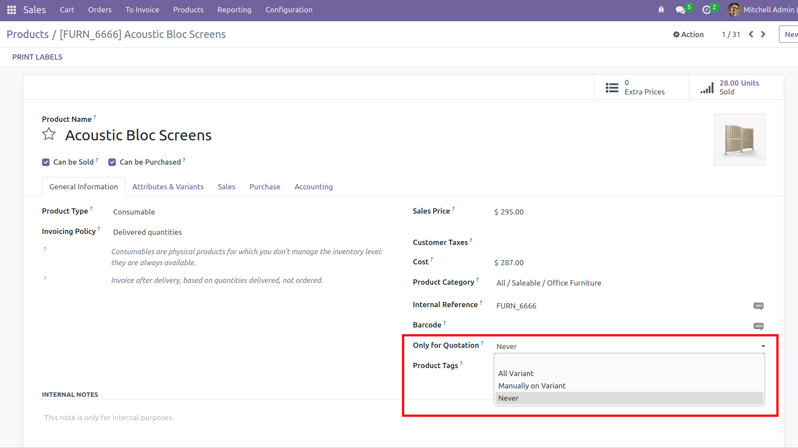
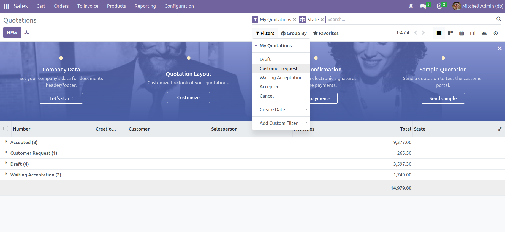

This module is used in the context of e-commerce project (like shopinvader)

It allow to define if your product do required a quotation.
This can be set per "product.template" or per "product.variant"

For example, you have a product where the supplier price fluctuate a lot,
you can not give a public price but your customer should be able to request a quotation.

On your shopinvader website when a customer have added a product that require a quotation,
instead of validating the cart it will "request a quotation".

On Odoo Backoffice the menu quotation have been improve and a new state (quotation_state) have been added.
So you can easily process and follow the quotation request from your external system.

